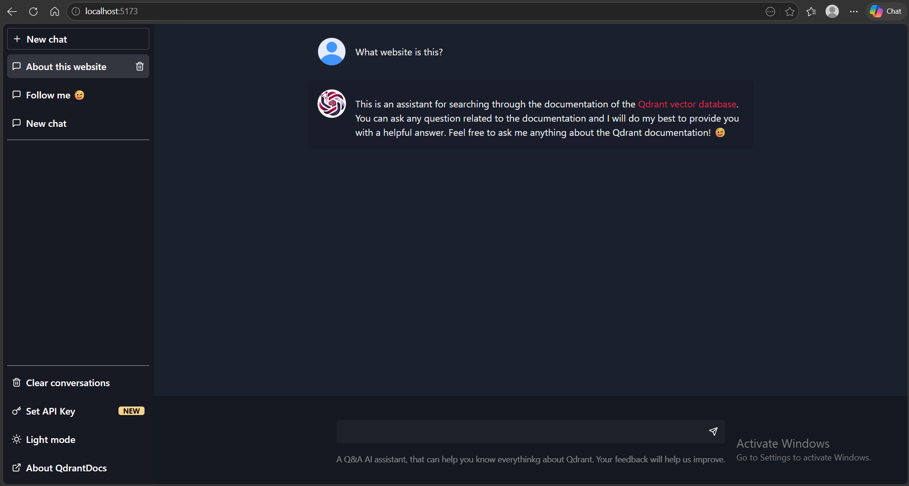
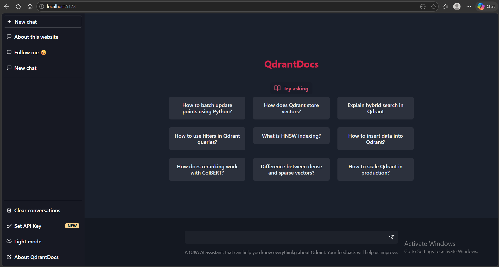
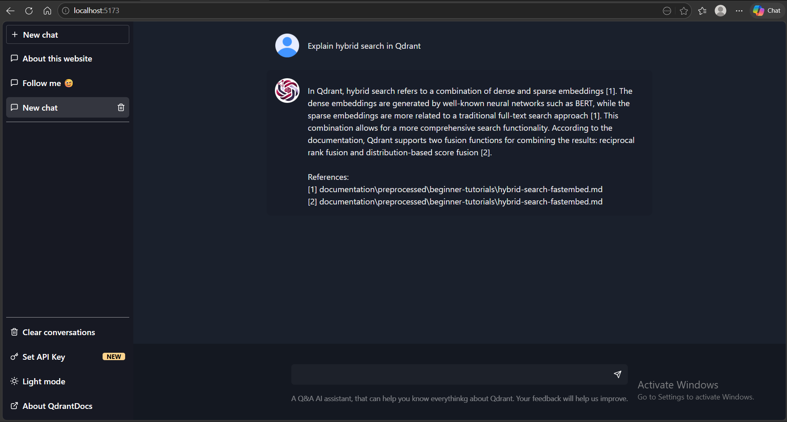
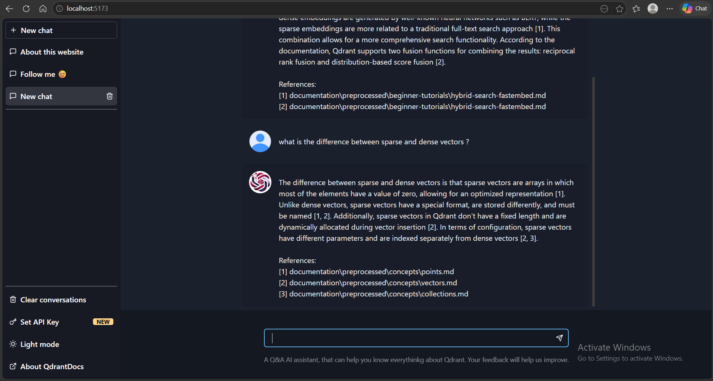

# 💻 QdrantDocs gpt – AI-Powered RAG Assistant for Qdrant Documentation

A Retrieval-Augmented Generation (RAG) assistant built for searching and interacting with the Qdrant documentation using hybrid vector search techniques.

This project combines:

- Dense embeddings
- Sparse embeddings
- Hybrid retrieval
- Reciprocal Rank Fusion (RRF)
- ColBERT reranking
- HNSW
- Streaming LLM responses
- Modern React frontend
- FastAPI backend
- Local Qdrant vector database

---

## 📑 Table of Contents

- [🖼️ Screenshots](#-screenshots)
- [🧩 Architecture](#-architecture)
- [🔧 Tech Stack](#-tech-stack)
- [⚙️ Project Structure](#️-project-structure)
- [🎯 Retrieval Pipeline](#-retrieval-pipeline)
- [👁️ Evaluation](#️-evaluation)
- [🔗 Setup](#-setup)
  - [Prerequisites](#prerequisites)
  - [Installation](#installation)
    - [1. Clone Repository](#1-clone-repository)
    - [Activate Virtual Environment](#activate-virtual-environment-)
    - [Install dependencies](#install-dependencies)
- [🐛 Environment Variables](#-environment-variables)
- [🧾 Qdrant Setup](#-qdrant-setup)
  - [Option A — Local Qdrant (Recommended)](#option-a--local-qdrant-recommended)
  - [Option B — Qdrant Cloud](#option-b--qdrant-cloud)
  - [📔Qdrant Collection Set Up](#-qdrant-collection-set-up)
    - [Create New Collection](#create-new-collection)
    - [Hnsw Config](#hnsw-config)
    - [Embed And Ingest](#embed-and-ingest)
- [⭐ Running the Application](#-running-the-application)
  - [Start Backend](#start-backend)
  - [Start Frontend](#start-frontend)
- [📄 API Endpoint](#-api-endpoint)
  - [Chat Endpoint](#chat-endpoint)
- [📄 Example Questions](#-example-questions)
- [Future Improvements](#future-improvements)
- [Acknowledgements](#acknowledgements)
- [⚡ Author](#author)

---

## 🖼️ Screenshots

<p align="center">
  
  
</p>

<p align="center">
  
  
</p>

## 🧩 Architecture

```text
User Query
    ↓
FastAPI Backend
    ↓
Embedding Generation
    ↓
Qdrant Hybrid Search
(Dense + Sparse + RRF + ColBERT)
    ↓
Top-K Relevant Chunks
    ↓
LLM Generation (Groq API)
    ↓
Streaming Response
    ↓
React Frontend UI
```

---

## 🔧 Tech Stack

### Backend
- Python
- FastAPI
- Qdrant
- Docker
- Groq API

### Frontend
- React
- Vite
- TypeScript
- Chakra UI
- Zustand
- React Query

### Retrieval Techniques
- Dense vector search (BAAI/bge-base-en-v1.5)
- Sparse vector search (prithivida/Splade_PP_en_v1)
- Hybrid search
- Reciprocal Rank Fusion (RRF)
- ColBERT late interaction retrieval (colbert-ir/colbertv2.0)
---

## ⚙️ Project Structure

```text
qdrant-search/
│
├── backend/
│   ├── api.py
│   ├── create_collection.py
│   ├── hnsw.py
│   ├── ingest.py
│   ├── requirements.txt
│   └── .env
│
├── frontend/
│   ├── public/
│   ├── src/
│   ├── index.html
│   ├── package-lock.json
│   ├── package.json
│   ├── tsconfig.json
│   └── vite.config.ts
│
│
│
├── evaluation/
│   ├── runs/
│   ├── annotation_readable.md
│   ├── evaluation_dataset.json
│   ├── evaluation.py
│   ├── pooling.py
│   ├── qrels.json
│   └── retrieve.py
│
│
│
├── documentation/
│   ├── dataset/
│   ├── preprocessed/
│   ├── raw/
│   └── scripts/
│
│
│
│
├── docker-compose.yml
├── README.md
└── .gitignore
```

---

## 🎯 Retrieval Pipeline

The system uses a complete RAG workflow:

1. Raw Qdrant Markdown documentation collected
2. Documents cleaned and preprocessed
3. Text chunking performed
4. Embeddings generated (Dense, Sparse, Colbert)
5. Data ingested into Qdrant
6. Hybrid retrieval executed
7. Relevant context sent to LLM
8. Response streamed back to frontend

---

## 👁️ Evaluation

I did some evaluation experiments of my system comparing:

- Dense retrieval
- Sparse retrieval
- Hybrid retrieval
- ColBERT retrieval
with differencet HNSW configs .

**Evaluation was performed using:**
- Custom query sets
- Ground-truth expected answers
- Retrieval relevance testing

**Evaluation metrics used :** 
- *Mean Reciprocal Rank (MRR)* : measures the effectiveness of information retrieval and ranking systems, focuses on the position of the first relevant result in a ranked list.
- *P@10 (Precision at 10):* measures the proportion of relevant items found within the top 10 results of a ranked list.
- *P@5 (Precision at 5)
- *R@10 (Recall at 10):* measures the proportion of all relevant items that are successfully retrieved within the top 10 results of a ranked list.
- *R@5 (Recall at 5)
- *nDCG@10 (Normalized Discounted Cumulative Gain at 10):* measures the quality of the top 10 results in a list, considering both the relevance of each item and its position.
- *nDCG@5 (Normalized Discounted Cumulative Gain at 5)*

```bash
cd evaluation
python evaluation.py
```

============================================================
## Evaluation Results
============================================================

System: colbert
MRR       : 0.8963
P@10      : 0.5519
P@5       : 0.6593
R@10      : 0.7580
R@5       : 0.4760
nDCG@10   : 0.7296
nDCG@5    : 0.6678

System: dense
MRR       : 0.7778
P@10      : 0.4481
P@5       : 0.5852
R@10      : 0.6151
R@5       : 0.4173
nDCG@10   : 0.6309
nDCG@5    : 0.6014

System: hybrid
MRR       : 0.8698
P@10      : 0.5000
P@5       : 0.6000
R@10      : 0.6947
R@5       : 0.4359
nDCG@10   : 0.7027
nDCG@5    : 0.6387

System: sparse
MRR       : 0.8006
P@10      : 0.4815
P@5       : 0.6222
R@10      : 0.6468
R@5       : 0.4489
nDCG@10   : 0.6474
nDCG@5    : 0.6162

---

# 🔗 Setup

## Prerequisites

- Python 3.10+
- Node.js 18+
- Docker (for local Qdrant) OR Qdrant Cloud account
- Git

---

## Installation

### 1. Clone Repository

```bash
git clone https://github.com/amine823/QdrantDocs_gpt.git
cd qdrant-search
```
### Activate Virtual environment .
```
python -m venv .venv
```
#### Windows

```bash
.venv\Scripts\activate
```

#### Linux / macOS

```bash
source .venv/bin/activate
```

---
### Install dependencies
```bash
pip install -r requirements.txt
cd frontend && npm install
```

---

## 🐛 Environment Variables
Create:

```text
backend/.env
```

Example:

```env
GROQ_API_KEY=your_groq_api_key
QDRANT_URL=http://localhost:6333
QDRANT_API_KEY=
```
---

## 🧾 Qdrant Setup

### Option A — Local Qdrant (Recommended)

Start Qdrant using Docker:

```bash
docker compose up -d
```

Qdrant will run locally at:

```text
http://localhost:6333
```

---

### Option B — Qdrant Cloud

Add QDRANT_URL and QDRANT_API_KEY to `.env` file in the backend folder:

```env
QDRANT_URL=https://your-cluster.qdrant.io
QDRANT_API_KEY=your-qdrant-api-key
```

---

## 📔Qdrant Collection Set Up

### Create new collection

```bash
cd backend
python create_collection.py
```

### hnsw config

```bash
python hnsw.py
```

### embed and ingest

```bash
python ingest.py
```
✅ all done

## ⭐Running the Application

### Start Backend

```bash
cd backend
uvicorn api:app --reload
```

Backend runs on:

```text
http://127.0.0.1:8000
```

---

### Start Frontend

```bash
cd frontend
npm run dev
```
(inside frontend directory.)

Frontend runs on:

```text
http://localhost:5173
```

---

## API Endpoint

### Chat Endpoint

```http
GET /chat?query=your_question
```

Streams the LLM response back to the frontend.

---

## 📄Example Questions

- What is the difference between sparse and dense vectors?
- How does hybrid search work in Qdrant?
- Explain ColBERT reranking
- How do I create a collection in Qdrant?
- What is HNSW indexing?

---

## Future Improvements

- Multi-model support
- User-provided API keys through ui.
- Authentication
- Citation highlighting
- Conversation export
- Document upload support
- Multi-source RAG
- Cloud deployment

---

## Acknowledgements

- Qdrant
- Groq
- Chakra UI
- React
- FastAPI
- Zustand

---

## ⚡Author

**Mohamed Amine Ezzeddine**

[](https://linkedin.com/in/amine-ezzeddine-8b5a71223/)
[](https://github.com/amine823)
[](mailto:amine.ezzeddine8@gmail.com)
